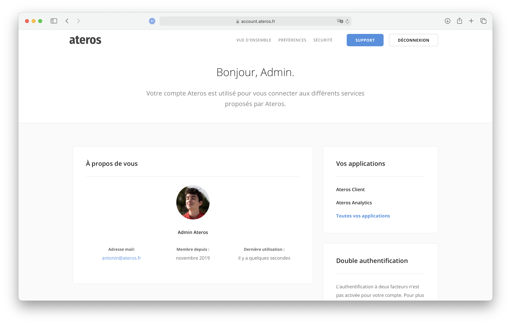
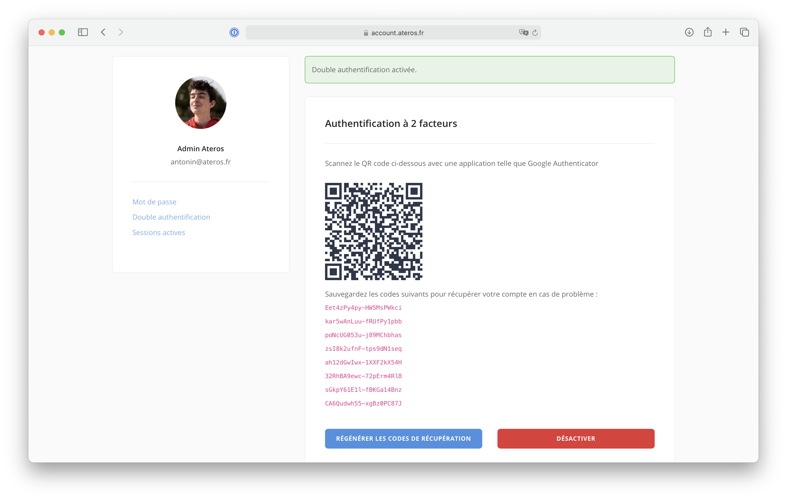

Ateros Account est un système de gestion de comptes centralisé développé pour l'entreprise [Ateros](https://ateros.fr).

## Fonctionnalités

Le cahier des charges était le suivant :

- Implémentation d'un système SSO permettant une connexion centralisée depuis plusieurs domaines différents
- Gestion de la double authentification
- Toutes les autres fonctionnalités classiques de gestion d'un compte : connexion, inscription, mot de passe oublié,
  suppression du compte...

## Technologies utilisées

#### Backend

- Laravel
- Laravel Fortify (double authentification, mot de passe oublié...)
- Laravel Passport (implémentation d'un serveur Oauth2)

#### Frontend

- Bootstrap
- [Hotwire Turbo](https://hotwire.dev) (framework Javascript HTML-over-the-wire)

## Captures d'écran

Quelques captures d'écran du produit fini (la totalité du site est testable sur [account.ateros.fr](https://account.ateros.fr))

#### Accueil

#### Double authentification

#### Sessions
