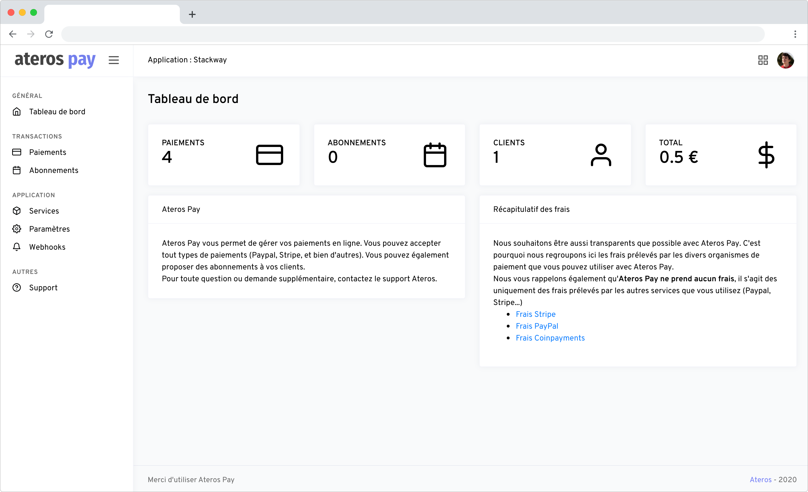
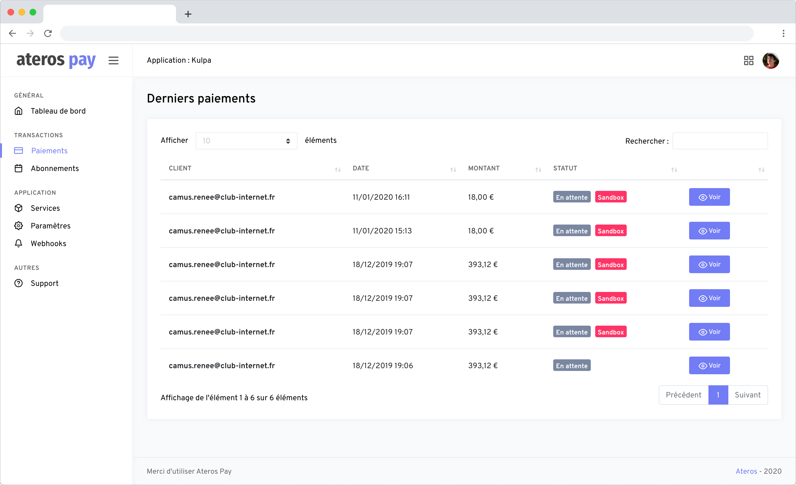

Comme j'ai eu l'occasion de développer, entre autres, des solutions de e-commerce pour mon
entreprise [Ateros](https://ateros.fr), nous avons eu l'idée de développer une gateway de paiement standardisée
permettant d'abstraire les APIs de chaque processeur de paiement (Stripe, PayPal, Coinbase pour les cryptomonnaies...).

Plus d'informations : [ateros.fr/pay](https://ateros.fr/pay)

J'ai également développé un client PHP en plus de l'API pour interagir avec la gateway : [github.com/AterosProjects/ateros-pay-client](https://github.com/AterosProjects/ateros-pay-client)

## Processeurs de paiements supportés
Voic les processeurs de paiements desquels j'ai intégré l'API à Ateros Pay :
- Paypal
- Stripe
- Coinbase

## Technologies utilisées
- Laravel
- Bootstrap

## Captures d'écran

#### Écran d'accueil

#### Gestion des paiements

