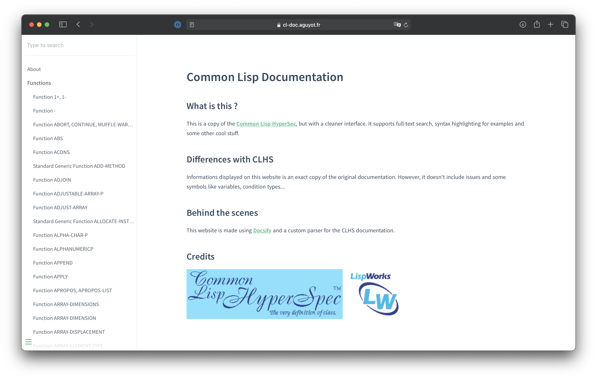

Dans le cadre de mes études, j'ai été amené à travailler avec le language LISP, dans sa variante appelée Common Lisp.

Aussi, j'ai pu constater l'absence d'une documentation claire et
moderne ([voyez par vous-même](http://www.lispworks.com/documentation/HyperSpec/Front/index.htm)), et j'ai décidé de
reproduire la documentation originale dans une interface claire et moderne (et cherchable en full-text !).

Le site est testable dans son intégralité sur [cl-doc.aguyot.fr](https://cl-doc.aguyot.fr)
## Technologies utilisées
- [Docsify](https://docsify.js.org), outil permettant de générer des documentations cherchables
- Un parseur de la documentation originale en un fichier PHP

Le code (dont le parseur) est libre et disponible sur Github : [github.com/anto2oo/clhs-evolved](https://github.com/anto2oo/clhs-evolved)

## Captures d'écran

