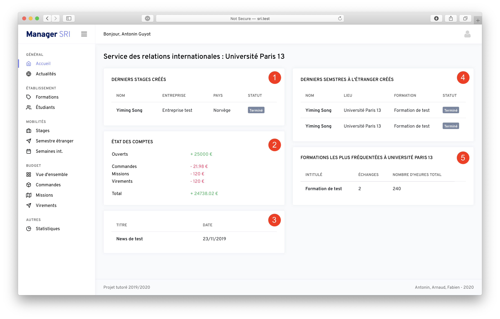
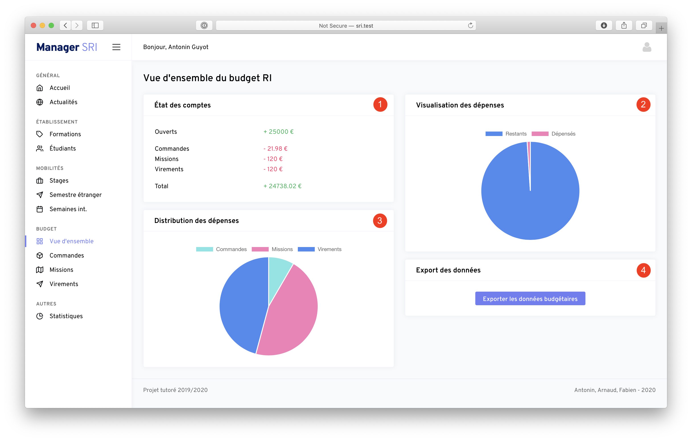
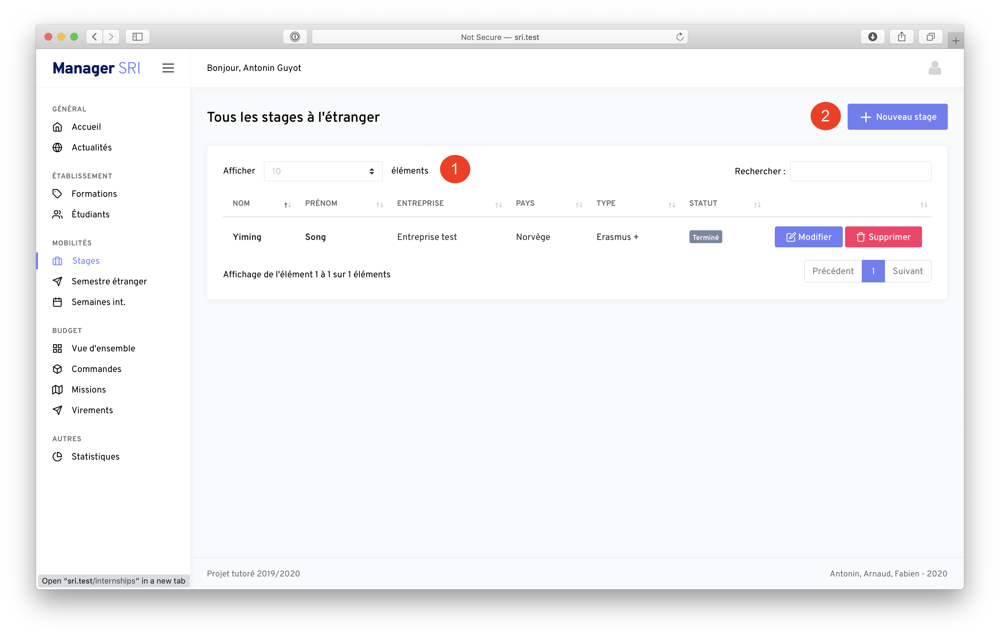

Au cours de ma dernière année de DUT Réseaux & Télécoms, j'ai dû réaliser un projet de fin d'études, pour lequel le
sujet était de créer un système d'information permettant la gestion du Service des Relations Internationales de
l'université.

Le site est testable sur [sri.aguyot.fr](https://sri.aguyot.fr).

## Cahier des charges

Le cahier des charges dressé après discussion avec le SRI de mon université était le suivant :

- Gérer un système d’actualité, permettant aux membres du SRI de publier des actualités afin que les étudiants puissent
  les lire.
- Proposer de créer et modifier des échanges, tout en distinguant le type d’échange (entrant, sortant) ainsi que la
  catégorie de ce dernier (stage, semestre…).
- Gérer le budget du SRI, c’est-à-dire pouvoir ajouter des dépenses en distinguant le type de dépense (commande,
  mission, virement), et permettre la visualisation des budgets alloués et utilisés.
- Accorder un soin particulier à la sécurité de l’application, étant donné qu’elle est susceptible de contenir des
  données sensibles.

## Technologies utilisées

- Laravel pour le backend
- Bootstrap en frontend

## Captures d'écran

#### Écran d'accueil

#### Gestion du budget

#### Gestion des stages à l'étranger

